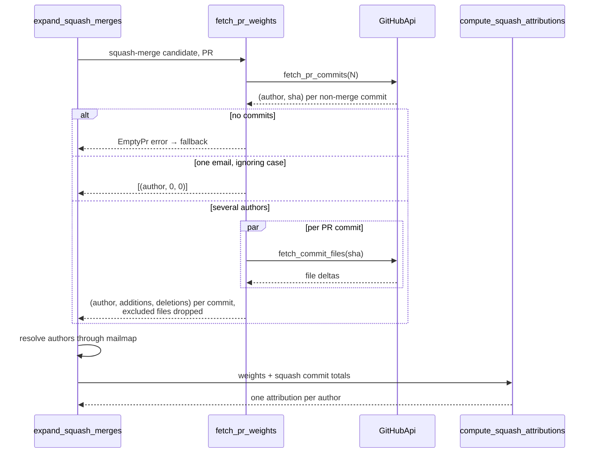

---
aliases:
  - PR Expansion and Split
tags:
  - attribution
  - github-api
---
[PR expansion](../Glossary/PR%20expansion.md) replaces a squash merge's single author with the authors of the pull request's original commits. git-credit lists the PR's commits through the GitHub API, weighs each author by the lines their commits changed, and splits the squash commit's own line totals in proportion to those weights.



> [!note]- See these pages for more info
> - [[#The GitHub API seam]]
> - [[#Weighing the authors]]
> - [[#The proportional split]]
> - [Fallback and the Accurate Flag](04%20Fallback%20and%20the%20Accurate%20Flag.md)
> - [Mailmap and Identities](05%20Mailmap%20and%20Identities.md)

## The GitHub API seam

All GitHub access goes through the [GitHub API trait](../Glossary/GitHub%20API%20trait.md), so the tests replace the network with an in-memory mock — [Testing](../Development/02%20Testing.md#the-mock-github-api).

```rust
// src/github.rs
pub trait GitHubApi: Send + Sync {
    /// List the author and SHA of each non-merge commit in the PR.
    ///
    /// GitHub lists at most 250 commits per PR; later ones are missing.
    fn fetch_pr_commits(&self, pr_number: u64) -> Result<Vec<(Author, String)>, CreditError>;

    /// Per-file line stats of a commit.
    ///
    /// Only the first page of files is read (up to 300), so larger commits are
    /// undercounted.
    fn fetch_commit_files(&self, sha: &str) -> Result<Vec<FileDelta>, CreditError>;
}
```

`Send + Sync` lets rayon call one client from many threads at once.

### The HTTP client

`GitHubClient` is the only production implementation. It is built only when a token and a GitHub [repository slug](../Glossary/Repository%20slug.md) are both available — [CLI Reference](../Usage/01%20CLI%20Reference.md#github-access).

- **Requests** go to `https://api.github.com/repos/{owner}/{repo}/…` with a `Bearer` token, `User-Agent: git-credit` and `Accept: application/vnd.github+json`, through a blocking `reqwest` client with a 30-second timeout.
- **Any non-success status is an error.** A rate-limit response becomes `CreditError::RateLimited`; any other becomes `CreditError::GitHubApi { status, body }` — [Fallback and the Accurate Flag](04%20Fallback%20and%20the%20Accurate%20Flag.md#detecting-a-rate-limit).
- **There are no retries.** One failed request fails the whole PR lookup.

### Listing the PR commits

`fetch_pr_commits` pages through `GET /pulls/{N}/commits?per_page=100&page={p}` until a page returns fewer than 100 commits.

- **Merge commits are dropped.** A PR commit with more than one parent, such as the base branch merged into the PR, carries other people's lines, so it must not weigh on the split.
- **The author is the git author GitHub recorded** (`commit.author.name` and `.email`), not the GitHub account; a missing name or email becomes `Unknown` or `unknown`.
- **GitHub stops listing at 250 commits.** Later commits of a longer PR are missing and weigh nothing.

### Fetching a commit's files

`fetch_commit_files` reads `GET /commits/{sha}` and keeps each entry of `files` with its `filename`, `additions` and `deletions`, dropping entries with no line changes.

- **Only the first page of files is read.** GitHub returns at most 300 files there, so a larger commit is undercounted.
- **The paths are GitHub's**, repository-relative like the local diff's, so the same exclusion globs apply.

## Weighing the authors

`fetch_pr_weights` turns a PR number into one `(author, additions, deletions)` [PR weight](../Glossary/PR%20weight.md) per PR commit.

```rust
// src/lib.rs — fetch_pr_weights
let pr_commits = client.fetch_pr_commits(pr_number)?;
let Some((first, _)) = pr_commits.first() else {
    return Err(CreditError::EmptyPr);
};
let first_email = first.email.to_lowercase();
if pr_commits.iter().all(|(a, _)| a.email.to_lowercase() == first_email) {
    return Ok(vec![(first.clone(), 0, 0)]);
}
pr_commits
    .into_par_iter()
    .map(|(author, sha)| {
        let (additions, deletions) = filter.line_totals(&client.fetch_commit_files(&sha)?);
        Ok((author, additions, deletions))
    })
    .collect()
```

- **An empty list is an error.** A PR whose commits are all merge commits (or none) raises `EmptyPr`, which falls back like any other failure.
- **The [single-author fast path](../Glossary/Single-author%20fast%20path.md) skips the file fetches.**
  - When every PR commit has the same email, compared case-insensitively, one author takes the whole commit, so no weights are needed; the zero weight triggers the equal split with one author.
  - The comparison uses the raw emails GitHub returned, before any mailmap; two emails that the mailmap merges still take the slow path, and then collapse into one attribution in the split.
- **Otherwise every PR commit's files are fetched in parallel**, and `ExclusionFilter::line_totals` sums only the non-excluded ones.
  - An author whose commits touched only excluded files — a regenerated lock file, say — weighs zero, so they cannot take credit for someone else's code — [File Exclusions](07%20File%20Exclusions.md).
- **Any failed request fails the PR.** `collect` into a `Result` stops at the first error.

### Mailmap after the fetch

The weights come back from the parallel phase with raw GitHub identities. `expand_squash_merges` then resolves each author through the mailmap, in its sequential pass, because libgit2's `Mailmap` is not `Sync` and cannot be shared across rayon threads. With `--no-mailmap`, the raw identities are kept — [Mailmap and Identities](05%20Mailmap%20and%20Identities.md).

## The proportional split

The [proportional split](../Glossary/Proportional%20split.md), `compute_squash_attributions`, divides the squash commit's own totals — its local diff against the first parent, excluded files already dropped — among the PR's authors. The weights set only the proportions; their sum can differ from the squash commit's totals, since the PR commits may have added and later removed lines.

```rust
// src/stats.rs — compute_squash_attributions (abridged)
let mut per_author: BTreeMap<String, (&Author, u64, u64)> = BTreeMap::new();
for (author, adds, dels) in weights {
    let entry = per_author.entry(author.email.to_lowercase()).or_insert((author, 0, 0));
    entry.1 += adds;
    entry.2 += dels;
}
// weight_adds, weight_dels: sums over all authors
let num_authors = (per_author.len() as u64).max(1);
per_author.into_values().map(|(author, adds, dels)| Attribution {
    additions: (additions * adds).checked_div(weight_adds).unwrap_or(additions / num_authors),
    deletions: (deletions * dels).checked_div(weight_dels).unwrap_or(deletions / num_authors),
    is_pr_author: true,
    /* name, email from the first-seen author */
})
```

- **Authors are merged by lowercased email.**
  - Entries whose emails differ only in case sum into one author, displayed with the first-seen spelling of both name and email.
  - The attributions come out ordered by lowercased email (the `BTreeMap` key), not by weight.
- **Each author's share is `floor(total × weight / total weight)`**, computed separately for additions and deletions.
- **A zero total weight falls back to an equal split**, `floor(total / authors)`, again separately for additions and deletions. This covers the single-author fast path and a PR whose commits touched only excluded files.
- **Integer division rounds down**, so the shares can sum to slightly less than the commit's totals: three authors with equal weight splitting 10 additions get 3 each, and one line goes to nobody.
- **Every attribution has `is_pr_author: true`**, and the report has `is_squash_pr: true` and `accurate: true`.

### Worked examples

These are the mock-API tests in `src/lib.rs`, with a squash commit of 100 (or 10) added lines:

| PR commits | Squash totals | Result |
| --- | --- | --- |
| Alice +30 in `a.rs`, Bob +10 in `b.rs` | +100 | Alice 75, Bob 25 |
| Alice +900 in `Cargo.lock`, Bob +10 in `src/main.rs`, with `--exclude "*.lock"` | +10 | Alice 0, Bob 10 |
| `Alice@Example.com` +30, `alice@example.com` +30, Bob +40 | +100 | `Alice@Example.com` 60, Bob 40 |
| `Alice@Example.com` and `alice@example.com` only | +100 | `Alice@Example.com` 100 (fast path) |

An author with zero weight still appears, with zero lines, as the second example shows; the table counts that row as a PR for them — [Table Output](../Usage/03%20Table%20Output.md).
