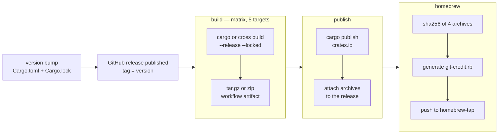

---
aliases:
  - Release
tags:
  - release
  - ci-cd
---
Publishing a GitHub release triggers [`.github/workflows/release.yaml`](../../.github/workflows/release.yaml), which builds binaries for five targets, publishes the crate to crates.io, attaches the binaries to the release, and updates the Homebrew formula in the `mscheltienne/homebrew-tap` repository. The version itself is set by hand in `Cargo.toml` before the release.

> [!note]- See these pages for more info
> - [[#Build]]
> - [[#Publish]]
> - [[#Homebrew]]
> - [[#Release checklist]]

## Versioning

- **The version lives in `Cargo.toml`.** It is what `--version` prints and what `cargo publish` uploads; bumping it is an ordinary commit that also updates the package's entry in `Cargo.lock`.
- **Tags are the bare version**, without a `v` prefix, judging by the existing tags (`0.6.0`, not `v0.6.0`).
- **Nothing checks that the tag matches `Cargo.toml`.** The crate is published with the `Cargo.toml` version, while the Homebrew formula takes its version and download URLs from the release's tag name; a mismatch would publish inconsistent versions.

## Build

The `build` job runs one matrix entry per target, with `fail-fast: false`:

| Target | Runner | Tool | Archive |
| --- | --- | --- | --- |
| `x86_64-unknown-linux-musl` | ubuntu-latest | `cross` | `git-credit-<target>.tar.gz` |
| `aarch64-unknown-linux-musl` | ubuntu-latest | `cross` | `git-credit-<target>.tar.gz` |
| `x86_64-apple-darwin` | macos-latest | `cargo` | `git-credit-<target>.tar.gz` |
| `aarch64-apple-darwin` | macos-latest | `cargo` | `git-credit-<target>.tar.gz` |
| `x86_64-pc-windows-msvc` | windows-latest | `cargo` | `git-credit-<target>.zip` |

- **`--release --locked`** builds the release profile against the committed `Cargo.lock`.
- **Linux binaries are static musl builds**, cross-compiled with `cross`. The `rustls` TLS backend and `git2` without network features keep them free of OpenSSL.
- **Each archive holds the single binary** and is uploaded as a workflow artifact for the next jobs.

## Publish

The `publish` job waits for every build, then:

1. Runs `cargo publish` with the `CARGO_REGISTRY_TOKEN` secret.
2. Downloads all build artifacts and attaches them to the release with `softprops/action-gh-release`.

Because `cargo publish` runs first, a failed publish (for example, a version already on crates.io) leaves the release without binaries and skips the Homebrew job.

## Homebrew

The `homebrew` job waits for `publish`, then:

1. Computes the SHA-256 of the four macOS and Linux archives; Windows has no formula.
2. Writes a `GitCredit` formula whose `on_macos` / `on_linux` and `on_arm` / `on_intel` blocks point at the release's download URLs, with a `--version` test.
3. Checks out `mscheltienne/homebrew-tap` with the `HOMEBREW_TAP_TOKEN` secret, copies the formula to `Formula/git-credit.rb`, and commits and pushes it as `github-actions[bot]` — only if it changed.

Users then install with `brew install mscheltienne/tap/git-credit`.

## Release checklist

1. Bump `version` in `Cargo.toml`, run `cargo build` so `Cargo.lock` follows, and merge the change to `main` with CI green.
2. Create a GitHub release on `main` whose new tag is the bare version, and generate its notes (bot PRs are left out — [Linting and CI](03%20Linting%20and%20CI.md#dependency-updates)).
3. Publish the release, then watch the `release` workflow: five builds, `publish`, `homebrew`.
4. Check the crate on crates.io, the archives on the release, and the formula commit in the tap.

The workflow needs two repository secrets, `CARGO_REGISTRY_TOKEN` and `HOMEBREW_TAP_TOKEN`; the release upload uses the automatic workflow token, which the workflow grants `contents: write`.

## Distribution channels

| Channel | Install |
| --- | --- |
| Homebrew tap (macOS, Linux) | `brew install mscheltienne/tap/git-credit` |
| crates.io | `cargo install git-credit` |
| Release archives | Download from the GitHub release |
| Source | `cargo install --path .` in a clone |
