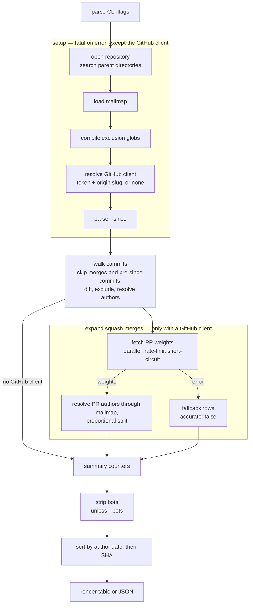

---
aliases:
  - Pipeline
  - Architecture
tags:
  - overview
  - attribution
---
One run of git-credit is a straight pipeline in `git_credit::run`: set up the inputs, walk the history once, expand the squash merges through GitHub in parallel, then filter, sort and render. Nothing is cached between runs.

## Stages



> [!note]- See these pages for more info
> - [Commit Walk](../Attribution/01%20Commit%20Walk.md)
> - [PR Expansion and Split](../Attribution/03%20PR%20Expansion%20and%20Split.md)
> - [Fallback and the Accurate Flag](../Attribution/04%20Fallback%20and%20the%20Accurate%20Flag.md)
> - [Mailmap and Identities](../Attribution/05%20Mailmap%20and%20Identities.md)
> - [Bots](../Attribution/06%20Bots.md)
> - [CLI Reference](../Usage/01%20CLI%20Reference.md)

```rust
// src/lib.rs — run (abridged)
let repo = git::open_repo(&cli.repo).context("could not open git repository")?;
let mailmap = load_mailmap(cli, &repo)?;
let filter = ExclusionFilter::new(&cli.excludes).context("invalid exclusion pattern")?;
let client = resolve_github_client(cli, &repo);
let since = /* --since parsed to epoch seconds */;
let commits = git::walk_commits(&repo, cli.rev.as_deref(), since, mailmap.as_ref(), &filter)?;

let mut commits = match client.as_deref() {
    Some(client) => expand_squash_merges(commits, client, mailmap.as_ref(), &filter),
    None => commits.iter().map(|c| author_report(c, true)).collect(),
};
let total_commits_walked = commits.len() as u64;
let squash_merges_expanded = commits.iter().filter(|c| c.is_squash_pr).count() as u64;
let bots_excluded = if cli.bots { 0 } else { strip_bots(&mut commits) };
commits.sort_by(|a, b| a.author_date.cmp(&b.author_date).then_with(|| a.sha.cmp(&b.sha)));
output::render(&report, &cli.format)?;
```

- **Setup runs before the walk.**
  - The repository is opened with libgit2's discovery, so `--repo` may point anywhere inside a working tree.
  - The GitHub client is resolved before `--since` is parsed, so the token lookup (possibly spawning `gh auth token`) and its warnings happen even on a run that then fails on a bad date.
- **The walk produces one `CommitInfo` per kept commit**, already carrying its excluded-file-free line totals, its mailmapped author, and its PR number if it is a [squash-merge candidate](../Glossary/Squash-merge%20candidate.md).
- **Expansion turns every `CommitInfo` into a [commit report](../Glossary/Commit%20report.md).**
  - Without a GitHub client, every commit, candidates included, becomes a single-author report with `accurate: true`.
- **The counters are taken before bot stripping** — [Summary counters](../Usage/02%20JSON%20Output.md#summary-counters).
- **The sort makes output deterministic.** `author_date` strings are fixed-width UTC, so comparing them as strings is chronological; the SHA breaks ties.

## Concurrency

- **Rayon parallelises the GitHub calls.**
  - `expand_squash_merges` maps every commit with `into_par_iter`; each squash-merge candidate fetches its PR commit list, then fetches the commits' files with a nested `into_par_iter`.
  - `reqwest`'s blocking client runs inside rayon's worker threads, so the number of simultaneous requests follows rayon's thread pool.
- **The mailmap is applied after the parallel phase.** libgit2's `Mailmap` is not `Sync`, so PR authors are resolved in the sequential pass that assembles the reports.
- **A shared `AtomicBool` records a rate limit**, so PR lookups that start after the first rate-limited response skip their requests — [Rate-limit short-circuit](../Glossary/Rate-limit%20short-circuit.md).
- **A progress bar counts PR lookups**, not commits, and is cleared when the parallel phase ends.

## Errors versus warnings

| Kind | Examples | Effect |
| --- | --- | --- |
| Fatal error | Repository not found, invalid `--since`, invalid `--rev` range, unreadable or unparsable `--mailmap-file`, git errors during the walk | `Error: <context>` plus a `Caused by:` chain on stderr, non-zero exit, no report |
| Warning | No GitHub token, `origin` is not a GitHub remote | `warning: …` on stderr; the run continues without GitHub |
| Warning | A PR lookup failed | The first failure's error, then a count of fallback PRs, on stderr; the affected rows carry `accurate: false` |

`main` returns `anyhow::Result`, so a fatal error prints through `anyhow`'s debug format and exits with status 1. Library errors are the `CreditError` enum in [`src/error.rs`](../../src/error.rs); `run` wraps them with `anyhow` context strings.
