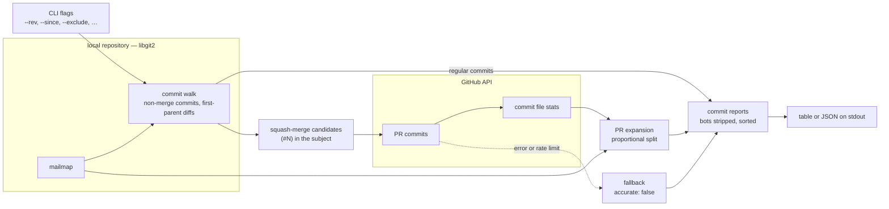
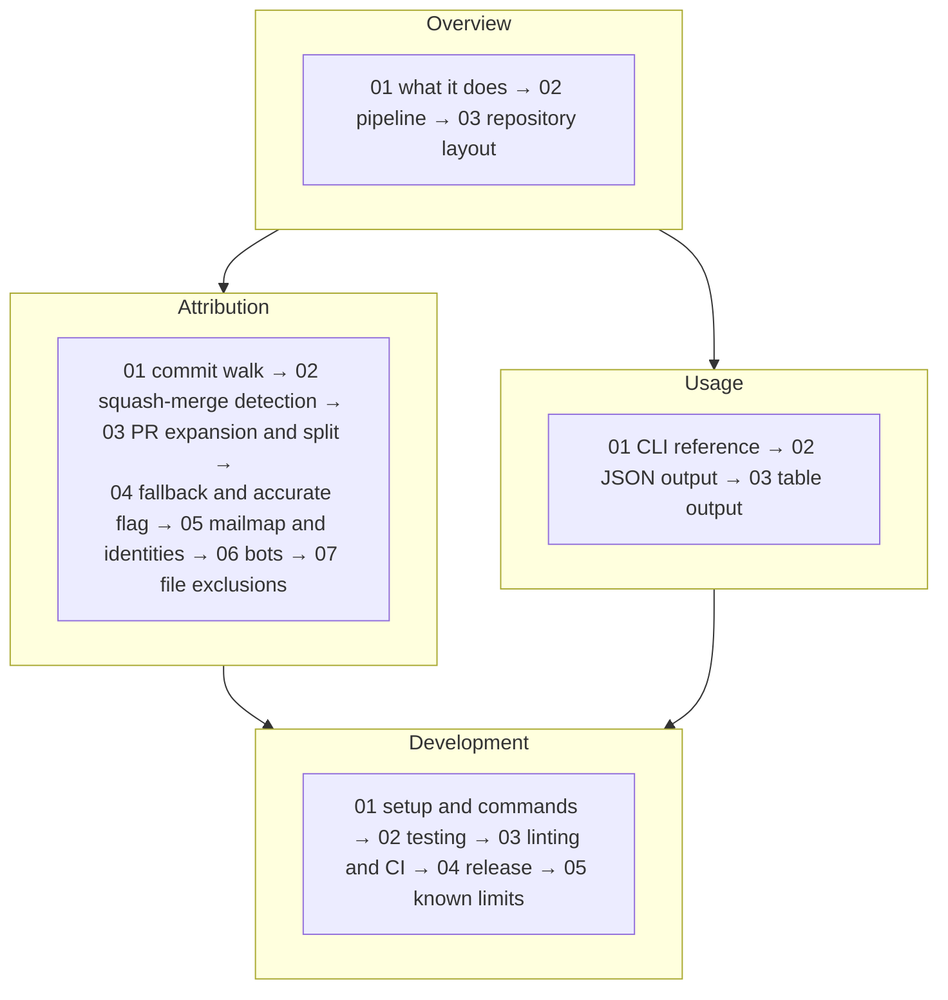

---
tags:
  - index
---
# git-credit knowledge base

Narrative documentation for [git-credit](https://github.com/mscheltienne/git-credit), the Rust command-line tool that computes per-author line contributions from a git history and sees through squash-merged pull requests. The notes are written for the people who maintain git-credit and for those who consume its output: what it computes and how, its command line and JSON contract, and how to develop, test and release it. A glossary defines every recurring term.

## Map of the tool



> [!note]- See these pages for more info
> - [[#Overview]]
> - [[#Attribution]]
> - [[#Usage]]

## How the notes build on each other

File names carry a number prefix that is the reading order within each folder. The folders have an order too: the overview introduces the vocabulary and the pipeline, the attribution folder explains each rule that decides who gets credit, usage covers the command line and the output contract, and development covers working on the code. Each note assumes the vocabulary of the ones before it and links back rather than re-explaining.



> [!note]- See these pages for more info
> - [[#Overview]]
> - [[#Attribution]]
> - [[#Usage]]
> - [[#Development]]

A consumer who only needs the output contract can read [What git-credit Does](Overview/01%20What%20git-credit%20Does.md), then the [[#Usage]] notes, then [Fallback and the Accurate Flag](Attribution/04%20Fallback%20and%20the%20Accurate%20Flag.md).

## Overview

What git-credit is, before the details.

1. [What git-credit Does](Overview/01%20What%20git-credit%20Does.md) — the squash-merge problem, what is computed per commit and per author, inputs and outputs, and what it does not do.
2. [Pipeline](Overview/02%20Pipeline.md) — the stages of one run, where the parallelism is, and which failures are fatal versus warnings.
3. [Repository Layout](Overview/03%20Repository%20Layout.md) — the source modules, tests, configuration files and dependencies.

## Attribution

The rules that decide who is credited with which lines.

1. [Commit Walk](Attribution/01%20Commit%20Walk.md) — `HEAD` or `--rev A..B`, the topological walk, skipped merge commits, `--since`, first-parent diffs with rename detection.
2. [Squash-Merge Detection](Attribution/02%20Squash-Merge%20Detection.md) — the `(#N)` rule, what a candidate becomes with and without GitHub, false positives.
3. [PR Expansion and Split](Attribution/03%20PR%20Expansion%20and%20Split.md) — the `GitHubApi` trait and HTTP client, pagination caps, weights, the single-author fast path, the proportional split and its rounding.
4. [Fallback and the Accurate Flag](Attribution/04%20Fallback%20and%20the%20Accurate%20Flag.md) — when a row is accurate, failed lookups, rate-limit detection and the short-circuit, retrying.
5. [Mailmap and Identities](Attribution/05%20Mailmap%20and%20Identities.md) — mailmap sources and flags, resolving an identity, case sensitivity, the PR author flag.
6. [Bots](Attribution/06%20Bots.md) — the `[bot]@` rule, stripping, and its effect on the counters.
7. [File Exclusions](Attribution/07%20File%20Exclusions.md) — glob syntax, and the two places the filter applies.

## Usage

Running git-credit and reading its output.

1. [CLI Reference](Usage/01%20CLI%20Reference.md) — every option, GitHub access, token resolution, remote URL parsing, exit status.
2. [JSON Output](Usage/02%20JSON%20Output.md) — the contract: an example, every field, invariants, the summary counters, consuming the rows.
3. [Table Output](Usage/03%20Table%20Output.md) — the per-author rollup, its columns and sort, the summary line.

## Development

Working on the code.

1. [Setup and Commands](Development/01%20Setup%20and%20Commands.md) — prerequisites, first run, every command, trying a change on a real repository.
2. [Testing](Development/02%20Testing.md) — unit tests, temporary repositories, the mock GitHub API, integration tests, gaps, coverage.
3. [Linting and CI](Development/03%20Linting%20and%20CI.md) — clippy pedantic, pre-commit, cargo-deny, the CI jobs, the MSRV pin, the audit workflow, dependency updates.
4. [Release](Development/04%20Release.md) — versioning, the release workflow's build, publish and Homebrew jobs, the checklist.
5. [Known Limits](Development/05%20Known%20Limits.md) — API caps, range and date selection, detection heuristics, split accuracy, identities.

## Glossary

One page per term; page names are the full term, with code names as aliases. The [Glossary README](Glossary/README.md) lists every page.

## Tags

Every note carries one or two frontmatter `tags`:

- **Topics**: `overview`, `attribution` (who gets credit for which lines), `github-api` (the GitHub side of expansion), `identity` (mailmap and bots), `cli`, `output` (the JSON and table formats).
- **Engineering**: `testing`, `ci-cd`, `release`, `tooling`.
- **`index`** marks the two READMEs.

## Modifying these docs

- Cross-note links are GitHub-style markdown links, **relative to the linking file**, with URL-encoded spaces and GitHub heading slugs for anchors: `[Commit Walk](Attribution/01%20Commit%20Walk.md#merge-commits-are-skipped)`. Same-note section links are the one wikilink exception: `[[#Heading text as written]]`. If you edit in Obsidian, turn off "Use `[[Wikilinks]]`" under Settings → Files and links and set "New link format" to "Relative path to file".
- Links to source files are relative paths into the repository (`../../src/git.rs` from a topic folder); they resolve on GitHub, not inside Obsidian.
- Diagrams are inline ```mermaid fenced blocks, followed by a collapsed "See these pages for more info" callout.
- Code the narrative depends on is excerpted into the note with a provenance comment naming the file and function, rather than cited by line number. When the code changes, update the excerpt and the prose around it.
- No tokens, secrets or personal addresses — use `@example.com` identities and placeholders such as `<sha>`.
- Community plugins are not committed ([`.gitignore`](.gitignore) excludes `.obsidian/plugins/` and the per-user workspace files); install them from Obsidian's community-plugin browser. Diagram layout needs **Mermaid ELK Renderer** with "Apply ELK to all diagrams" and "Override existing layout" enabled; **Wikilinks to MDLinks** converts stray wikilinks to the markdown-link convention above.
- Writing conventions: active voice, no meta-openers ("This note covers…"), parallel items as bullets with explainer sub-bullets, collapsed callouts (`> [!note]- Title`), a subheader for every term another note might link to, and glossary links on a term's first use in each `##` section.
- A new recurring term gets a glossary page: the full term as the file name, code names as `aliases`, a one-to-two-sentence definition, and a `Covered in:` line anchored to the defining heading. List it in the [Glossary README](Glossary/README.md).
