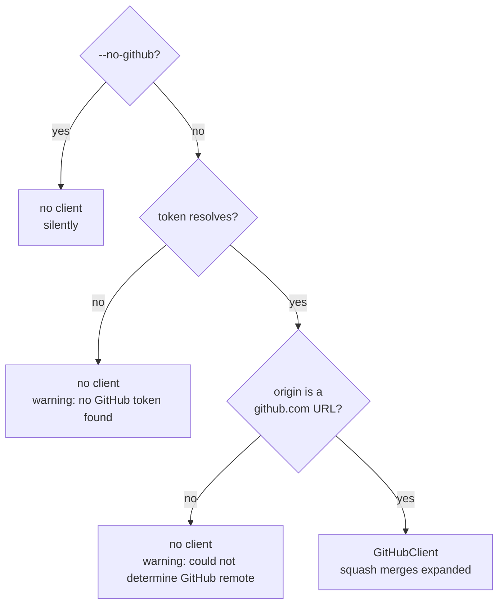

---
aliases:
  - CLI Reference
tags:
  - cli
---
git-credit takes no subcommands and no positional arguments: `git-credit [OPTIONS]`. Every option is defined on the clap `Cli` struct in [`src/cli.rs`](../../src/cli.rs), whose doc comments are also the `--help` text.

## Options

| Option | Default | Effect |
| --- | --- | --- |
| `--repo <PATH>` | `.` | Repository to analyse; libgit2 searches upwards from `PATH` for the repository |
| `--exclude <GLOB>` | none | Drop matching files from all line counts; repeatable — [File Exclusions](../Attribution/07%20File%20Exclusions.md) |
| `--since <YYYY-MM-DD>` | none | Keep only commits authored on or after midnight UTC of that date — [Commit Walk](../Attribution/01%20Commit%20Walk.md#the---since-cut-off) |
| `--rev <A..B>` | `HEAD` | Walk only this two-dot range — [Commit Walk](../Attribution/01%20Commit%20Walk.md#which-commits-are-walked) |
| `--format <table\|json>` | `table` | Output format — [Table Output](03%20Table%20Output.md), [JSON Output](02%20JSON%20Output.md) |
| `--token <TOKEN>` | resolved | GitHub token; overrides the environment — [[#GitHub access]] |
| `--no-github` | off | Never call GitHub; squash merges become regular commits with `accurate: true` |
| `--bots` | off | Keep `[bot]@` identities — [Bots](../Attribution/06%20Bots.md) |
| `--mailmap-file <PATH>` | none | Use this mailmap instead of the repository's — [Mailmap and Identities](../Attribution/05%20Mailmap%20and%20Identities.md) |
| `--no-mailmap` | off | Report identities as recorded; conflicts with `--mailmap-file` |
| `-h`, `--help` | | Help; `-h` prints the one-line summaries, `--help` the full text |
| `-V`, `--version` | | The version from `Cargo.toml` |

`--since` and `--rev` combine: the range selects the commits, and the date filters them.

## GitHub access

A run expands squash merges only when it has a GitHub client, which needs both a token and a GitHub `origin`. `resolve_github_client` in [`src/lib.rs`](../../src/lib.rs) decides:



> [!note]- See these pages for more info
> - [[#Token resolution]]
> - [[#Remote URL parsing]]
> - [Fallback and the Accurate Flag](../Attribution/04%20Fallback%20and%20the%20Accurate%20Flag.md)

A missing token or remote is a warning, not an error: the run continues as with `--no-github`.

### Token resolution

[Token resolution](../Glossary/Token%20resolution.md) takes the first non-empty value, in order:

1. `--token`.
2. The `GITHUB_TOKEN` environment variable.
3. The `GH_TOKEN` environment variable.
4. The output of `gh auth token`, trimmed, if the GitHub CLI is installed and exits successfully.

- **Empty values are skipped**, so an exported but empty `GITHUB_TOKEN` does not hide `GH_TOKEN`.
- **`gh` runs lazily.** `resolve_token_from_sources` takes the `gh` lookup as a closure and calls it only when the first three sources yield nothing, so a run with `--token` or an environment token never spawns `gh`.
- **The token needs read access** to the repository's pull requests and commits; a token that lacks it produces 403 or 404 responses, which fall back with `accurate: false`.

### Remote URL parsing

The [repository slug](../Glossary/Repository%20slug.md) (`owner/repo`) comes from the URL of the remote named `origin`; no other remote is considered.

```rust
// src/github.rs
static GITHUB_URL_RE: LazyLock<Regex> = LazyLock::new(|| {
    Regex::new(r"(?:^|[@/])github\.com[:/]([^/]+)/([^/]+?)(?:\.git)?/?$").unwrap()
});
```

| Remote URL | Slug |
| --- | --- |
| `https://github.com/owner/repo.git` | `owner/repo` |
| `https://github.com/owner/repo/` | `owner/repo` |
| `git@github.com:owner/repo.git` (scp-style) | `owner/repo` |
| `ssh://git@github.com/owner/repo.git` | `owner/repo` |
| `https://github.com/owner/my.repo.git` | `owner/my.repo` |
| `https://gitlab.com/owner/repo` | none |
| `https://notgithub.com/owner/repo` | none |

- **`github.com` must follow the start, an `@` or a `/`**, which rejects look-alike hosts such as `notgithub.com`.
- **Dots are allowed in the repository name**; only a trailing `.git` and a trailing `/` are stripped.
- **Only github.com is recognised.** GitHub Enterprise hosts, and `origin` URLs rewritten through `insteadOf` aliases or SSH host aliases, yield no slug. (That git-credit reads the stored URL, before any `insteadOf` rewrite, is inferred from its use of libgit2's `Remote::url`.)

## Exit status and streams

- **stdout** carries only the report.
- **stderr** carries warnings, the progress bar and errors.
- **The exit status is 0** unless a fatal error occurs, in which case it is 1 and nothing is printed to stdout — [Pipeline](../Overview/02%20Pipeline.md#errors-versus-warnings).

## Examples

```sh
# The current repository, table output
git-credit

# Another repository, as JSON, without touching GitHub
git-credit --repo /path/to/repo --format json --no-github

# Commits reachable from main but not from main~50, lock files excluded at any depth
git-credit --rev main~50..main --exclude '**/*.lock'

# Everything authored in 2025 or later, with an external mailmap
git-credit --since 2025-01-01 --mailmap-file /path/to/.mailmap

# Recompute one commit
git-credit --rev '<sha>^..<sha>' --format json
```
